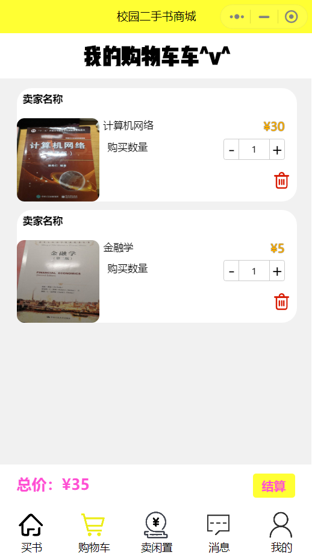

## 校园二手书商城小程序

- 本项目作为期末作业提交

### 项目参与及分工

| 姓名   | 班级    | 学号       | 分工                   |
| ------ | ------- | ---------- | ---------------------- |
| 高鹏宇 | 18信管6 | 3118004050 | nodejs+mysql           |
| 陈王谦 | 18信管6 | 3118004047 | wxml+wxss              |
| 戴震   | 18信管6 | 3118004048 | js（微信小程序逻辑层） |
| 张晓雯 | 18信管6 | 3218004078 | 背景分析及文档撰写     |

### 实现功能

- 用户信息管理
  - [x] 微信账号登录
  - [x] 自动注册
  - [x] 用户信息修改
- 出售闲置书籍
  - [x] 闲置书籍一键上传
  - [x] 闲置书籍分类
  - [x] 书籍图片拍摄、上传、修改
- 购买二手书
  - [x] 二手书模糊搜索
  - [x] 二手书成色查看
- 购物车
  - [x] 购物车商品调整
  - [x] 商品统一结算
- 商品管理
  - [x] 商品状态自由控制
  - [x] 商品信息修改
- 订单管理
  - [x] 订单自动生成
  - [x] 历史订单查询
- 信息推送
  - [ ] 商品出售提醒（待完善）
  - [ ] 买家卖家交流（待完善）
- 后台相关
  - [x] 使用Nodejs架设服务器
  
  - [x] 使用Mysql数据库
  
  - [x] 购买云服务器并部署

### 使用方法

1. 开发者服务器和数据库已部署在云服务器上（<http://119.29.28.23:8888>），无需再部署，不过还是提供了服务器代码和数据库脚本。

2. 数据库及服务器部署（可跳过）

    进入service文件夹
    
    生成数据库
    
    ```
    source mall.sql
    ```
    安装依赖包
    ```
    npm install
    ```
    启动服务
    ```
    node mall.js
    ```
    服务器使用8888端口

3. 请在https://mp.weixin.qq.com/ 得到appid和secret，微信开发者工具中设置appid。
在mine.js中设置好appid和secret。
   
4. 开始使用小程序

### 项目结构

```
imis-booksmall-miniprogram
├─ README.md
├─ booksmall
│    ├─ app.js
│    ├─ app.json
│    ├─ app.wxss
│    ├─ images
│    ├─ pages
│    │    ├─ cart
│    │    ├─ collect
│    │    ├─ discover
│    │    ├─ goodsDetail
│    │    ├─ history
│    │    ├─ index
│    │    ├─ login
│    │    ├─ message
│    │    ├─ mine
│    │    ├─ myInfo
│    │    ├─ orderDetail
│    │    ├─ search
│    │    ├─ sell
│    │    └─ submitOrder
│    ├─ project.config.json
│    ├─ sitemap.json
│    └─ utils
├─ screenshot
├─ service
│    ├─ mall.js
│    ├─ mall.sql
│    └─ package.json
└─ 小程序报告.pdf
```

### 项目截图





